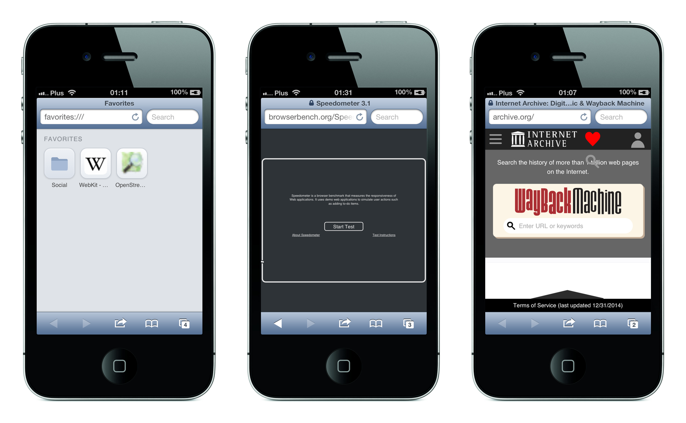
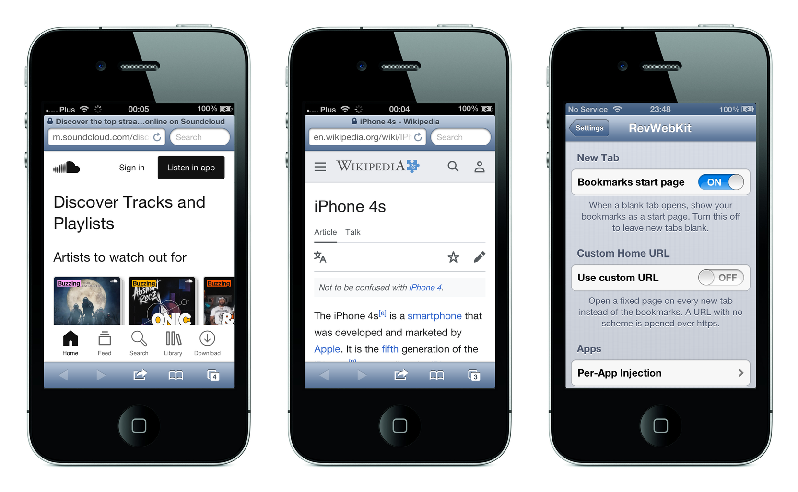
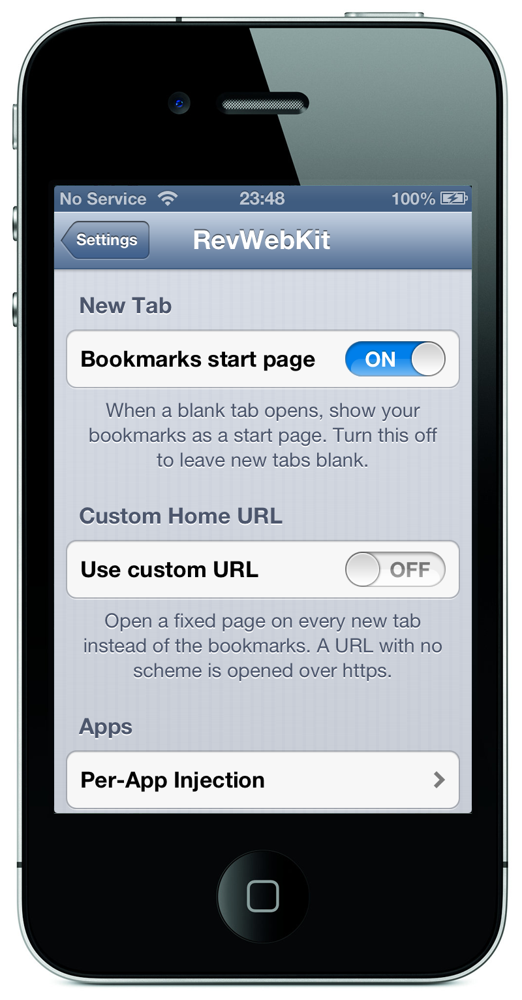

# Revenant WebKit

**A current WebKit for hardware the web left for dead.**

A modern WebKit engine, built from source for **armv7**, running today's websites
on an **iPhone 4S from 2011** — a dual-core 800 MHz phone with 512 MB of RAM, on
**iOS 6.1.3**. The engine is dropped underneath the phone's own **Mobile Safari**,
so the stock browser renders the modern web with none of its own UI replaced.

The engine the phone ships with is WebKit 536 from 2012. It cannot render a page
written this decade — a modern sign-in form comes back with no input elements at
all, because the script that builds it never runs. Nor can the phone still
negotiate TLS with a current server, or perform the cryptography a login form
needs. Each of those is fixed here.

<p align="center">
  
  <br>
  <em>Google, YouTube and the new-tab start page — on an iPhone 4S, in Mobile Safari.</em>
</p>

<p align="center">
  
  <br>
  <em>SoundCloud, Wikipedia, and the RevWebKit Settings pane.</em>
</p>

## Contents

- [What works](#what-works)
- [How it works](#how-it-works)
- [Requirements](#requirements)
- [Build](#build)
- [Deploy and test](#deploy-and-test)
- [The Settings pane](#the-settings-pane)
- [Repository layout](#repository-layout)
- [Notes and design](#notes-and-design)
- [License](#license)

## What works

- **Current WebKit**, built from source for armv7 with a 6.0 deployment target:
  current C++ compiled for a 2011 phone.
- **Real Mobile Safari on the new engine.** A MobileSubstrate tweak re-launches
  Safari with the engine forced underneath it; the user agent reports
  `AppleWebKit/605` instead of the stock `536`. UIKit's own gestures, scrolling
  and text selection are reused unchanged.
- **JavaScript with a JIT.** Upstream deleted the ARMv7 JIT; it is restored here,
  with the regressions that restoring it caused fixed as well.
- **TLS 1.2 / 1.3.** The system's TLS is from 2012 and current servers refuse its
  cipher suites. The port answers the system's TLS calls over OpenSSL, so the
  browser reaches sites the phone otherwise cannot open. Certificate verification
  is unchanged — the chain is evaluated by the system as a real `SecTrustRef`.
- **Web Crypto**, performed by WebKit's own OpenSSL backend rather than the Cocoa
  one, which works in CryptoKit and has no armv7 Swift: digests, HMAC, AES in GCM,
  CBC, CFB and CTR, AES key wrapping, HKDF, PBKDF2, ECDSA, ECDH, RSA-OAEP and
  RSASSA-PKCS1 all verified on the device.
- **WebAssembly** (via a bundled interpreter, since JSC's WASM is
  64-bit only), **Web Notifications**, **getUserMedia** (camera + microphone),
  `<video>` MediaStream preview, and a wave of self-contained web APIs enabled by
  default.
- **Web fonts and form controls.** Both were entirely absent rather than
  approximate: no `@font-face` had ever loaded a font in any format, and every
  button, field, checkbox and select was painted in a fully transparent colour.
  Sites now draw with their own typefaces and their controls can be read.
- **Scrolling inside a page.** Overflow blocks and frames are scrolled by the
  system's own `UIWebOverflowScrollView`, the way this release of iOS does it,
  which is what makes cookie dialogs and any other inner scroller usable.
- **The image formats the web actually serves.** WebP is decoded by WebKit's own
  decoder, since this ImageIO cannot; the formats that remain undecodable are no
  longer advertised to servers, which had been negotiating pictures the browser
  could not render.
- **A native Settings pane** (`RevWebKit`) for the new-tab start page, a custom
  home URL, and per-app engine injection. See [The Settings pane](#the-settings-pane).

## How it works

The engine lives in the dyld shared cache, so there is no file to replace and no
way to swap it for one process only. Instead a small loader is injected into the
launching app, sets `DYLD_FRAMEWORK_PATH` / `DYLD_INSERT_LIBRARIES` to point at
the port's engine, and re-execs the app. The second launch loads the new engine
first. Three artifacts do this:

| Artifact | On device | Built by | Role |
| --- | --- | --- | --- |
| **Loader** | `/Library/MobileSubstrate/DynamicLibraries/RevSafari.dylib` | `scripts/build-safari-tweak.sh` | Reads the enabled-apps preference and re-execs an enabled app with the engine's `DYLD_*` set. Skips SpringBoard. |
| **Engine** | `/usr/lib/rev-fw/{JavaScriptCore,WebCore,WebKit}.framework` | `scripts/configure-engine.sh` + `ninja`, laid out by `scripts/layout-sys-frameworks.sh` | The WebKit build itself. |
| **Compat / hooks** | `/usr/lib/rev-safari-compat.dylib` | `scripts/build-safari-compat.sh` | The ABI symbols iOS 6 predates, plus the bookmarks start page, WebAssembly, and preference reads. Inserted by the loader. |

The loader and the compat dylib are two different files with two different jobs —
overwriting one with the other drops Safari back to the system engine.

## Requirements

**Device**

- iPhone 4S (armv7), iOS 6.1.3, jailbroken, with **MobileSubstrate/CydiaSubstrate**.
- A working TLS shim on the device (the modern-TLS layer) and OpenSSH for deploys.

**Build host** (macOS)

- Xcode's toolchain and an **iOS 13.7 SDK** — the newest SDK that still emits
  armv7 and accepts a 6.0 deployment target. Point `IOS_SDK` at it.
- `cmake`, `ninja`, and **`ldid`** (for ad-hoc signing).

## Build

```sh
export IOS_SDK="$HOME/path/to/iPhoneOS13.7.sdk"   # any SDK that still emits armv7

./fetch-source.sh          # WebKit at a fixed commit, then this port's patches
./build.sh                 # libc++, ICU, OpenSSL, compat, the engine, the app
```

`build.sh` runs the steps under `scripts/`, each worth running alone when only
one thing changed:

| Step | Builds |
| --- | --- |
| `scripts/build-libcxx.sh` | libc++ for armv7 |
| `scripts/build-icu.sh` | ICU, trimmed to the kept languages |
| `scripts/build-openssl.sh` | OpenSSL, for TLS and Web Crypto |
| `scripts/build-compat.sh` | `libios6compat.a`, the symbols iOS 6 lacks |
| `scripts/configure-engine.sh` | CMake configure — the flags carry why each is set |
| `ninja -C build-254-lto WebCore WebKitLegacy JavaScriptCore` | the engine |

### The Safari substitution, as a package

The engine is built by CMake; everything that goes on the device around it is
built and packaged by [Theos](https://theos.dev), from `packaging/`:

```sh
scripts/layout-sys-frameworks.sh          # stage the engine as dist/rev-sys-fw
make -C packaging package FINALPACKAGE=1  # packaging/packages/*.deb
```

One `.deb` carries all of it: the loader and its MobileSubstrate filter, the
compatibility and hook dylib, the TLS library, the Settings bundle with its
PreferenceLoader entry, and the engine frameworks. Install it the way any tweak
is installed:

```sh
dpkg -i space.kern0x1b.rev_*_iphoneos-arm.deb
```

Two settings in `packaging/common.mk` and `packaging/compat/Makefile` are not
optional, and each says why where it is set: modules are off, because this SDK
still ships `mach-o/module.map` under its deprecated name; and the compat dylib
is built without `_FORTIFY_SOURCE` and without libc++, because the `__*_chk`
symbols are linkage this release never had, and the engine carries its own C++
runtime — a second one in the same process is a crash waiting to happen.

The individual scripts under `scripts/` still exist and still work; they are the
faster loop when only one piece changed.

## Deploy and test

The device address and password are **not** in the repository. Copy the example
and fill it in:

```sh
cp device.env.example device.env    # set DEVICE_HOST / DEVICE_PORT / DEVICE_PASSWORD
```

Then push the substitution and the Settings pane, backing up each target first:

```sh
scripts/deploy-safari-tweak.sh      # loader + filter + compat + bundle, then respring
```

or install the package, which does the same thing and can be removed again:

```sh
make -C packaging package FINALPACKAGE=1
scp packaging/packages/*.deb root@device:/tmp/ && ssh root@device dpkg -i /tmp/*.deb
```

**Verify it took.** Open any page in Safari and check the user agent — a request
to a service that echoes it (or the on-device engine log at
`/tmp/rev-safari-stderr.log`) should show `AppleWebKit/605`, not `536`. The stock
engine renders modern Google/YouTube broken; the port renders them as above.

**Screenshots from the device:** `/usr/bin/shot` writes `/tmp/screenshot.png`;
`scp` it back. This is how the images in this README were made.

**Iterating on the Settings pane** does not need a respring — redeploy
`RevPrefs.bundle`, then `killall Preferences` and reopen it.

## The Settings pane

Installed as **`RevWebKit`** in the system Settings app, as a real
PreferenceBundle. It writes the `space.kern0x1b.rev` preferences domain that the engine
reads:

- **Bookmarks start page** — a blank tab renders your Safari bookmarks as tiles.
  Turning it off collapses the rest.
- **Custom Home URL** — open a fixed page on every new tab instead. A URL with no
  scheme is opened over `https`.
- **Per-App Injection** — a list of installed apps; the engine is injected only
  into the ones turned on (Safari by default). Injecting the engine into an
  arbitrary app is experimental and reversible (turn it off and respring).
- **Respring** — restart SpringBoard from the pane.

<p align="center">
  
</p>

## Repository layout

```
app/            The standalone application: window, web view, engine bridge, TLS
compat/         Symbols iOS 6 does not have, built into libios6compat.a
patches/engine/ This port's changes to WebKit, by area
platform/
  safari/       The Safari substitution: the loader and the compat/hooks source
  prefs/        The RevWebKit Settings PreferenceBundle
  apps/         Web app manifests
  ...
scripts/        The build and deploy, one step per script
tools/          Diagnostic tools, on the host and on the device
notes/          Measurements, findings and the design journal
docs/           Screenshots and documentation assets
webkit-254/     The engine, a git submodule on the ios6-armv7 branch
```

## Notes and design

The reasoning behind the port and the measurements behind each decision are in
`notes/` — `notes/design-journal.md` is where it started, and the `night-run-*.md`
files record what was tried, what worked, and what was refuted by measuring it.

## License

MIT, see `LICENSE`. The engine is WebKit and carries its own licenses; the
patches under `patches/engine/` are changes to that source.
